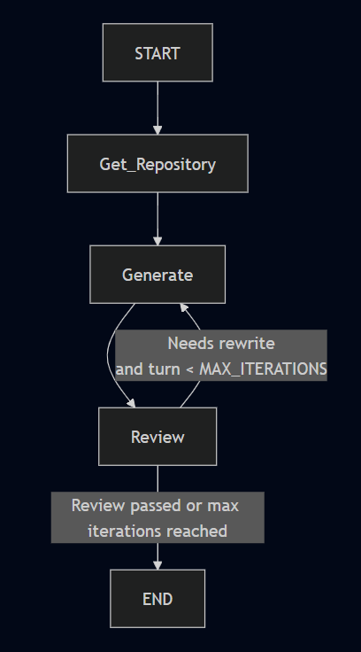
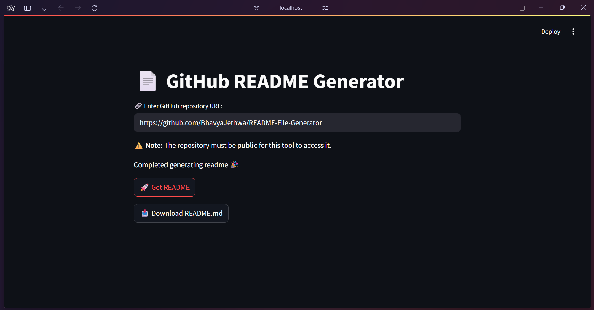

# 📄 GitHub README Generator

## Description

The **GitHub README Generator** is an AI-powered tool that generates professional and comprehensive `README.md` files for any public GitHub repository. It automatically analyzes your project's code and structure to provide clear, best-practices documentation, making your repos more understandable and attractive to contributors and users. ✨

**Key Features:**
- Paste any public GitHub repository URL to generate a tailored README.
- Automatically examines project files and code structure.
- Iterative review for improved README quality.
- Friendly, interactive markdown with emoji for better presentation.

---
## Graph
 <!-- Replace with an actual screenshot if available -->

## Table of Contents

- [Description](#description)
- [Installation](#installation)
- [Usage](#usage)
- [Configuration](#configuration)
- [API Reference](#api-reference)
- [Screenshots or Demos](#screenshots-or-demos)
- [Technologies Used](#technologies-used)

---

## Installation

1. **Clone the Repository**
   git clone https://github.com/your-username/readme-generator.git
   cd readme-generator

2. **Set Up Virtual Environment (Recommended)**
   python -m venv venv
   source venv/bin/activate  # On Windows: venv\Scripts\activate

3. **Install Dependencies**
   pip install -r requirements.txt

4. **Start the Backend (FastAPI)**
   uvicorn backend.main:app --reload

5. **Start the Frontend (Streamlit)**
   streamlit run frontend/app.py

---

## Usage

1. 🚀 **Launch the Application**
   - Start the FastAPI backend in one terminal.
   - Start the Streamlit frontend in another terminal.

2. 🌐 **Open the App**
   - Navigate to [http://localhost:8501](http://localhost:8501) in your browser.

3. 🔗 **Enter Repository URL**
   - Paste any public GitHub repository URL in the provided input box.

4. 📄 **Generate README**
   - Click "🚀 Get README" and let the tool process your repository!
   - Download your generated `README.md` file when ready.

---

## Configuration

The generator does not require complex configuration by default.

- If your deployment or future versions use environment variables, make sure to follow any prompts or document details in a `.env` file.
- Ensure that CORS is enabled in FastAPI for local Streamlit communication.

---

## API Reference

### `POST /generate_readme`

**Description:**  
Generate a README for a given public GitHub repository.

**Request JSON:**
{
  "repo_url": "https://github.com/your-username/your-repo"
}

**Response JSON:**
{
  "readme": "<rendered-markdown-readme>"
}

---

## Screenshots or Demos

**Web UI Example:**  
The app provides a user-friendly text field to enter your repo URL and a button to generate/download the README.

 <!-- Replace with an actual screenshot if available -->

---

## Technologies Used

- **FastAPI:** Backend web API
- **Streamlit:** Interactive UI frontend
- **LangChain:** Language model orchestration
- **OpenAI GPT-4:** Core AI for README generation and review
- **GitPython:** For safe cloning and inspection of repositories
- **Python:** Core logic and scripting

---

Happy documenting! 🎉
